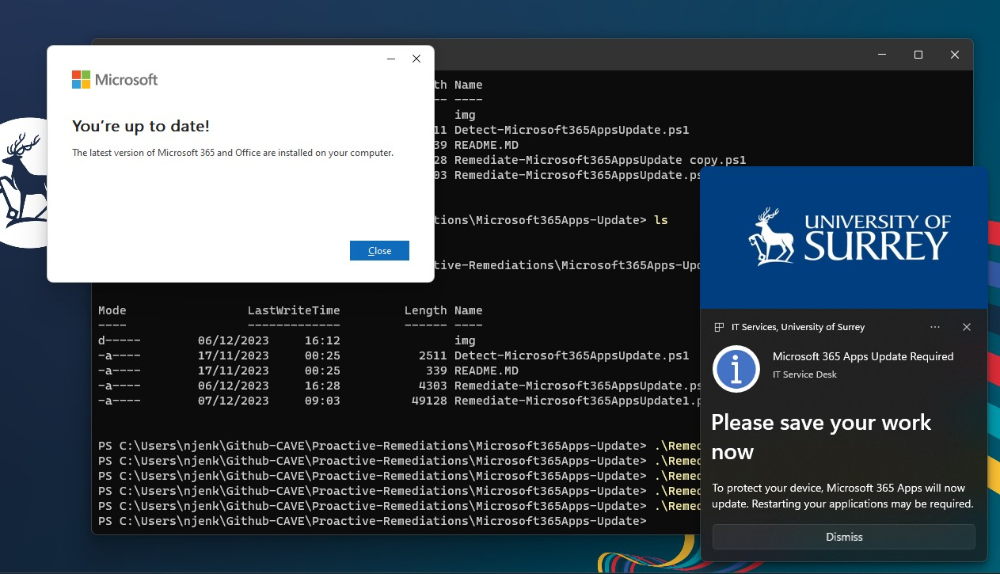

# Update the Microsoft 365 Apps

Detects the installed version of the Microsoft 365 Apps and compares against the minimum required version for that update channel, then invokes an update. Run scripts in the end user content.

Needs to be run in 64bit context

A notification is displayed to the end user when the update is invoked.

